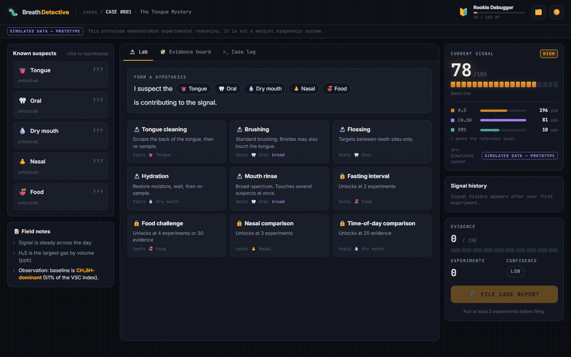
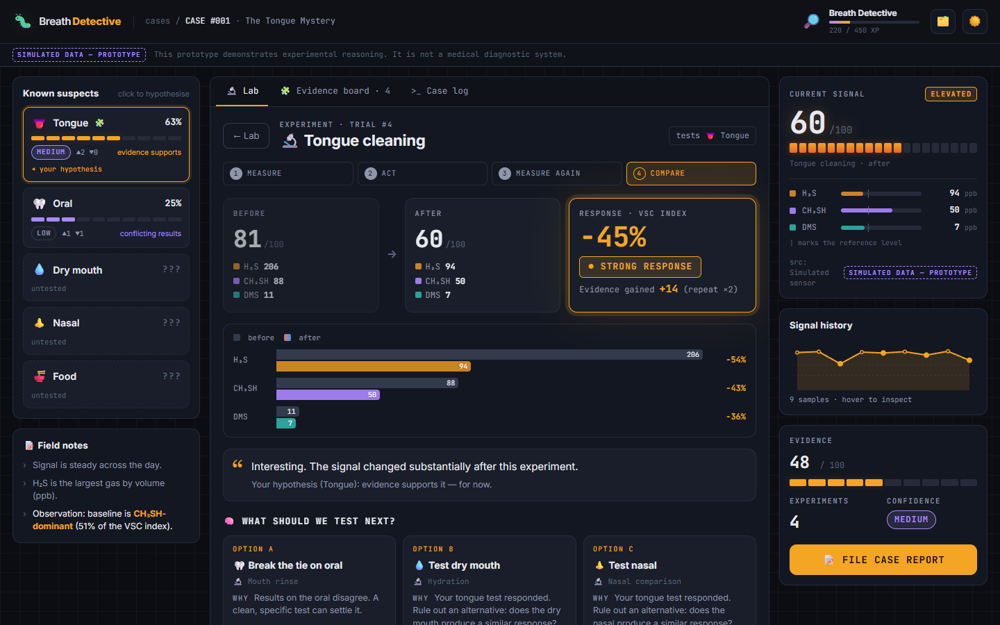
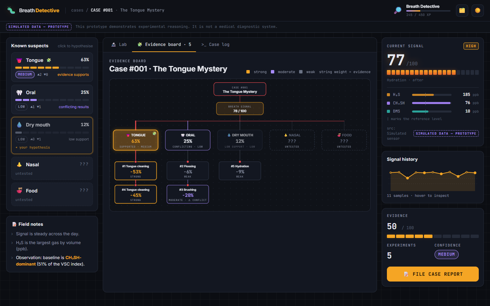
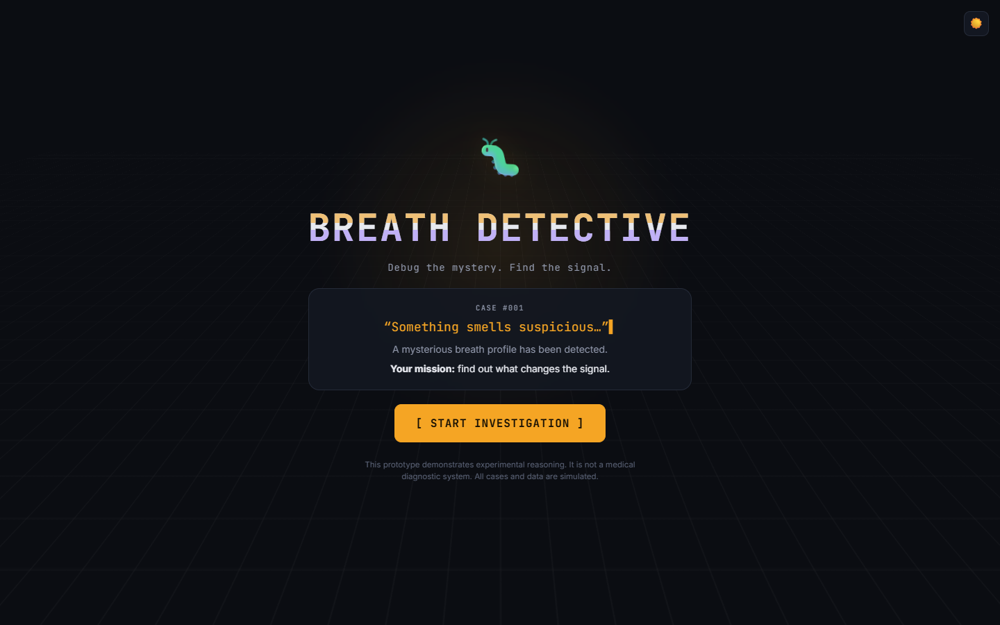
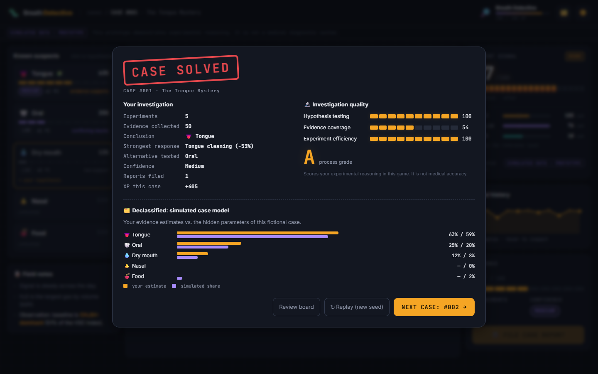

# 🐛 Breath Detective

> Debug your breath like you debug software.

[](#-project-status)
[](LICENSE)
[](package.json)
[](docs/ARCHITECTURE.md)
[](CONTRIBUTING.md)

What if instead of asking

> *"Do I have bad breath?"*

we asked

> *"What **changes** my breath signal?"*

Breath Detective turns a bad-breath investigation into a debugging session:
**Measure → Hypothesis → Experiment → Compare → Evidence.**



> 🚧 **Experimental prototype.** All measurements are simulated and all cases are fictional.
> This is a game about experimental reasoning — **not** a medical or diagnostic tool.

---

## What is this?

A breath sensor gives you a number. A number on its own doesn't tell you much: *is 180 ppb of H₂S coming from the tongue? The gums? Last night's garlic?*

Developers have a well-practised answer to "something is wrong and I don't know why": you don't stare at the error, you **change one thing and see what happens**. Breath Detective applies that loop to breath. You get a mysterious case, take a baseline, form a hypothesis ("I suspect the tongue"), run a targeted experiment (clean the tongue), measure again, and see how much the signal moved.

Behind the scenes, every case has a hidden model of which suspects contribute to the signal. You never see it. You only see measurements — exactly like real life — and have to infer the answer from how the signal responds to your experiments.

It's a playable prototype today, and an open question for tomorrow: **could this kind of structured self-experimentation ever be useful with a real sensor?** That's the part we'd love help with.

## The Idea

```
  MEASURE          baseline sample
     ↓
  HYPOTHESIS       "I suspect the tongue is contributing"
     ↓
  EXPERIMENT       clean the tongue
     ↓
  MEASURE AGAIN    post-intervention sample
     ↓
  COMPARE          −45% → strong response
     ↓
  EVIDENCE         tongue hypothesis gains support
     ↓
  NEXT TEST        replicate? rule out an alternative?
```

**Why is this different from just measuring?** A single reading says *how much*. A before/after pair says *what responds*. Repeating the experiment says *whether it was noise*. Testing an alternative suspect says *whether you're fooling yourself*. The game rewards exactly those habits: replication, ruling out alternatives, noticing when a broad test (like mouth rinse) hits several suspects at once, and not running every test blindly.

## Current Prototype

What it **is**:

- ✅ A browser game with **simulated** breath measurements (H₂S, CH₃SH, DMS → a 0–100 signal)
- ✅ **5 fictional cases**, each with different hidden contributors (and per-playthrough randomness, so you can't memorise answers)
- ✅ **9 experiments** (some unlock as you gather evidence), an evidence board, "what should we test next?" suggestions
- ✅ XP, ranks, achievements, and an end-of-case *investigation quality* score
- ✅ No backend, no accounts — progress lives in your browser's `localStorage`

What it **is not**:

- ❌ Not a medical diagnosis, and it can't tell you why *your* breath smells
- ❌ No real sensor required (or supported yet) — a Bluetooth provider exists only as a stub
- ❌ Simulation parameters are game-tuned, not clinically validated

## Demo

| Run an experiment | Evidence board |
|---|---|
|  |  |

| Title screen | Case solved |
|---|---|
|  |  |

## Run Locally

Requires [Node.js](https://nodejs.org/) 18 or newer.

```bash
git clone https://github.com/devain/breath-detective.git
cd breath-detective
npm install
npm run dev        # → http://localhost:5173
```

Other commands:

```bash
npm run build      # production build into dist/
npm run preview    # serve the production build
npm run sim        # headless balance check: runs every experiment on every case
                   # (⚠️ prints the hidden case models — spoilers!)
```

To reset your progress, use **Case files → Reset progress**, or clear the site's `localStorage`.

## How It Works

The game logic lives in plain JavaScript under [`src/game/`](src/game), separate from the React UI. Full walkthrough: **[docs/ARCHITECTURE.md](docs/ARCHITECTURE.md)**.

**Simulation engine** — [`caseEngine.js`](src/game/caseEngine.js). Each case secretly says how much each suspect (tongue, oral, dry mouth, nasal, food) contributes. Each suspect has a gas "fingerprint" (e.g. food is DMS-heavy). A sample is:

```
gas    = ambient + intensity × Σ (contribution × load × fingerprint)
index  = H₂S/112 + CH₃SH/26 + DMS/8        ← composite "VSC index"
signal = 100 × (1 − e^(−index / 4))         ← 0–100, saturating
```

**Measurement model** — [`src/game/measurement/`](src/game/measurement). The UI only ever calls `provider.measure()`. Today that's `SimulatedMeasurementProvider` (seeded noise, reproducible). A `BluetoothMeasurementProvider` stub shows where real hardware would plug in.

**Experiment system** — [`experimentEngine.js`](src/game/experimentEngine.js) + [`data/experiments.js`](src/data/experiments.js). An experiment scales suspect "loads" (tongue cleaning removes ~78% of tongue load). The response is the % change in the VSC index: **strong ≥ 35%**, **moderate ≥ 15%**, otherwise weak.

**Evidence system** — [`evidenceEngine.js`](src/game/evidenceEngine.js). Results add evidence points (repeats and broad tests earn less), build per-suspect *evidence %* and *confidence*, flag contradictions, detect patterns, and generate the "what should we test next?" suggestions.

**Case system** — [`data/cases.js`](src/data/cases.js). A case is just data: a description, field notes, hidden factors and noise. Adding one is a ~20-line PR.

## Roadmap

Deliberately open. Checked items exist today; everything else is an invitation.

### 🟢 Prototype
- [x] Simulated measurements (H₂S / CH₃SH / DMS)
- [x] Hypothesis → experiment → compare loop
- [x] Evidence system with confidence and contradictions
- [x] 5 fictional cases with per-playthrough randomisation
- [x] Gamification (XP, ranks, achievements, quality score)
- [x] `MeasurementProvider` abstraction
- [ ] Unit tests for the game engines
- [ ] Export an investigation as JSON/CSV

### 🔬 Research
- [ ] Better, documented simulation model
- [ ] Sourced reference values for gas thresholds and profiles
- [ ] Real-world measurement protocol (timing, controls, confounders)
- [ ] Collaboration with clinicians / dental researchers
- [ ] Experimental dataset (consented, anonymised)
- [ ] Breath fingerprint analysis

### 🧪 Hardware
- [ ] Survey of available VSC sensors and open hardware
- [ ] Working BLE measurement provider
- [ ] Sensor connection UI
- [ ] Portable prototype

### 🤖 AI
- [ ] Information-gain based experiment recommendation
- [ ] Pattern discovery across investigations
- [ ] Breath-profile clustering
- [ ] Research analytics

See [docs/RESEARCH.md](docs/RESEARCH.md) for what is known, what is hypothesis, and what would need real studies.

## Contributing

**You don't need to understand the whole project to help.** A new fictional case is one object in one file. A better chart is one component. A sharp question about the experimental design is just as valuable as code.

We especially want: frontend & game developers · data/ML people · hardware & sensor tinkerers · dentists, clinicians & researchers · UX and game designers · anyone with a good idea.

👉 Start with **[CONTRIBUTING.md](CONTRIBUTING.md)** and the [`good first issue`](https://github.com/devain/breath-detective/labels/good%20first%20issue) label.

## Open-source philosophy

This project is intentionally experimental. It doesn't pretend the hard parts are solved — the simulation is a toy, the sensor is a stub, and the core research question is unanswered.

The interesting question is whether developers, researchers, clinicians, hardware people and AI folks can build the idea *together* — and find out whether it holds up.

> **Don't just send code. Challenge the experiment.**
>
> Think the response threshold is arbitrary? That mouth rinse is a terrible test? That the whole premise is flawed? [Open an issue](https://github.com/devain/breath-detective/issues/new/choose) — that's a contribution.

## 🚧 Project status

**Experimental / early prototype.** Expect rough edges and breaking changes. This is not healthcare software, makes no diagnostic claims, and should not be used to make health decisions. If you're worried about your breath, talk to a dentist or doctor.

## License

[MIT](LICENSE) © Diet Nguyen and contributors.
