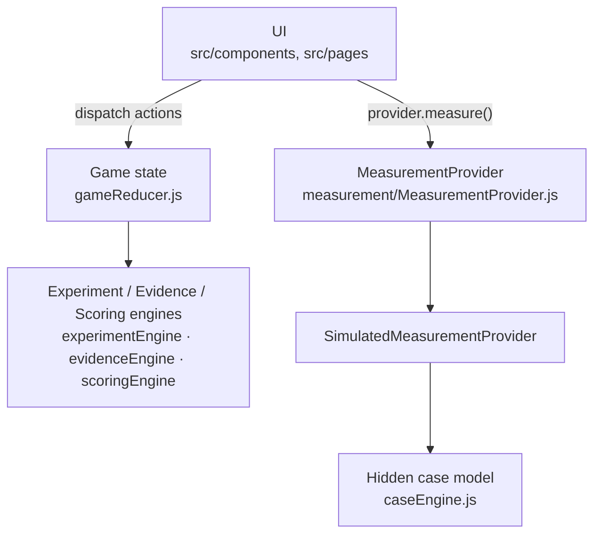
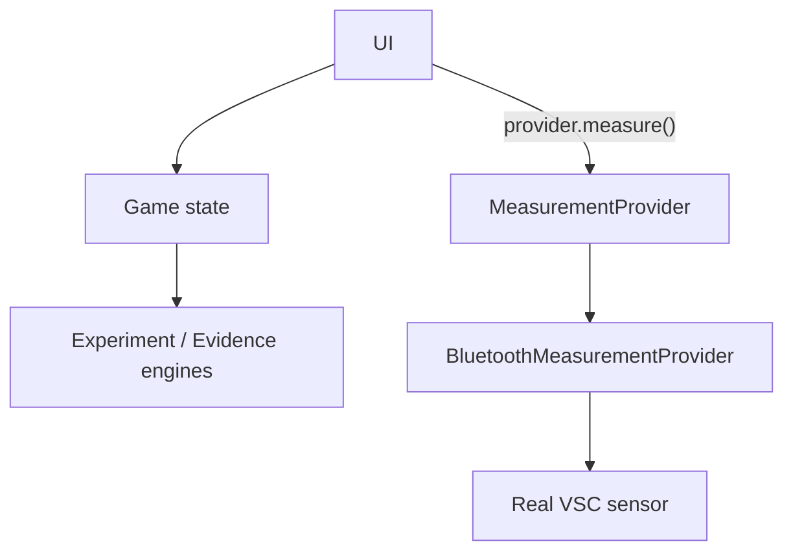

# Architecture

Breath Detective is a small, client-only React app. There is no backend. The interesting part is how the game logic is split so that **the game never cares where a measurement came from**.

## The big picture

**Today:**



**Later (the goal):**



Only the box under `MeasurementProvider` changes. Experiments, evidence, scoring and UI stay the same.

## Core principle

> **Measurements are the only interface between the world and the game.**

The experiment and evidence engines see exactly what a player sees: `before` and `after` measurements. They never read the hidden case model. Only `caseEngine.js` (and the simulated provider, which asks it for samples) knows the answer — plus `checkReport()` at the very end, to grade the report.

This keeps the game honest and makes it possible, in principle, to swap in real hardware.

## Folder map

```
src/
├── data/                         ← pure data, the easiest place to contribute
│   ├── cases.js                  fictional cases + their hidden factors
│   ├── experiments.js            experiment catalog (effects, unlocks)
│   ├── hypotheses.js             the 5 suspects + gas fingerprints, reference levels
│   └── progression.js            XP values, ranks, achievements
├── game/                         ← framework-free JS, no React imports
│   ├── caseEngine.js             hidden model, breath "physics", report check
│   ├── experimentEngine.js       unlocks, response %, strength, trial records
│   ├── evidenceEngine.js         evidence points, per-suspect stats, patterns, next-test suggestions
│   ├── scoringEngine.js          ranks, investigation-quality score, achievements
│   ├── gameReducer.js            all state transitions (pure reducer)
│   ├── storage.js                localStorage load/save
│   ├── rng.js                    seeded PRNG (mulberry32) + gaussian noise
│   └── measurement/
│       ├── MeasurementProvider.js            the interface
│       ├── SimulatedMeasurementProvider.js   samples the hidden model
│       ├── BluetoothMeasurementProvider.js   Web Bluetooth stub (not wired in)
│       └── index.js                          createMeasurementProvider() — the switch
├── components/                   ← React UI pieces (lab, runner, board, HUD, modals…)
├── pages/                        ← TitleScreen, CaseSelect, Investigation
├── hooks/useGame.js              useReducer + persistence + count-up animation hook
├── App.jsx, main.jsx, styles.css
scripts/simulate.mjs              headless balance check (npm run sim)
```

## Data models

**Measurement** — what every provider must return:

```js
{
  timestamp: 1727851200000,
  h2s: 180, ch3sh: 75, dms: 20,  // ppb
  index: 7.0,                    // composite VSC index (see below)
  signal: 82,                    // 0–100
  source: 'simulated' | 'ble',
  label: 'Tongue cleaning · after'
}
```

**Experiment record** — produced by `evaluateTrial()` after every run:

```js
{
  id: 'trial-3', trial: 3,
  experimentId: 'tongue_clean', hypothesis: 'tongue',
  stated: 'tongue',              // the player's hypothesis at the time
  before, after,                 // Measurements
  responsePct: -0.45,            // change in VSC index
  effective: 0.45,               // response in the direction that would support the hypothesis
  strength: 'strong' | 'moderate' | 'weak',
  repeatIndex: 0,                // how many times this experiment ran before
  contradicts: false,            // disagrees with earlier results on this suspect?
  points: 24,                    // evidence gained
  estimate: 0.58                 // rough "how much of the signal is this suspect" from this run
}
```

**Run** — one playthrough of a case (persisted to localStorage): `caseId`, `seed`, `baseline`, `measurements[]`, `experiments[]`, `evidenceTotal`, `statedHypothesis`, `patterns`, `reportAttempts`, `result`, `log[]`.

## The simulation model

Each suspect `f` has a hidden **contribution** `cᶠ` (from `cases.js`, jittered ±~10% per seed and normalised) and a **load** `Lᶠ` that starts at 1 for every sample.

```
gas_g  = ambient_g + intensity × Σ_f  cᶠ × Lᶠ × fingerprint_f,g
index  = H₂S/112 + CH₃SH/26 + DMS/8
signal = round(100 × (1 − e^(−index/4)))
```

An experiment multiplies loads: `Lᶠ ← Lᶠ × (1 − effectᶠ × compliance)`, where `compliance` is a seeded 0.88–1.08. Negative effects add load (the food challenge triples food load). Each gas then gets seeded gaussian noise (σ = the case's `noise`, 3.5–5%).

Each experiment's "before" is a fresh baseline sample; the run doesn't carry state between experiments. Same seed + same trial number = same numbers, so playthroughs are reproducible and `npm run sim` is deterministic.

> The fingerprints, reference levels and effect sizes are **game-tuned placeholders**, not clinical data. Improving and sourcing them is an open research task — see [RESEARCH.md](RESEARCH.md).

## Evidence & confidence

| Thing | Rule (see `evidenceEngine.js`) |
|---|---|
| Strength | effective response ≥ 35% strong, ≥ 15% moderate, else weak |
| Evidence points | strong 20–30, moderate 10–20, weak 2–6; × 1 / 0.6 / 0.25 for 1st / 2nd / 3rd+ repeat; × (0.6 + 0.4 × specificity); halved if contradictory |
| Supporting / contradicting | strong or moderate supports; weak contradicts |
| Evidence % | specificity-weighted mean of `estimate` over that suspect's runs |
| Confidence | **High**: ≥3 runs with ≥75% agreement, or 2 agreeing runs from different experiments. **Medium**: ≥2 runs with ≥66% agreement. **Low**: otherwise |
| Pattern | ≥2 supporting runs at Medium+ confidence, or ≥2 contradicting runs |

"What should we test next?" (`suggestNextTests`) is a small scored rule set: replicate a single strong result, cross-check with a different experiment, isolate suspects a broad test also touched, pivot after a weak result, try newly unlocked tools.

## Game state flow

All state changes go through `gameReducer` — the UI only dispatches intents:

| Action | What happens |
|---|---|
| `START_CASE` | new run with a random seed |
| `BASELINE` | first measurement stored, XP, achievements |
| `STATE_HYPOTHESIS` | player picks a suspect |
| `RECORD_TRIAL` | `evaluateTrial()` → evidence, XP, patterns, unlocks, achievements |
| `FILE_REPORT` | `checkReport()` against the hidden model → solved (score) or rejected |

The measurement itself is async (it may be a real device), so the UI component (`ExperimentRunner`) awaits `provider.measure()` and then dispatches `RECORD_TRIAL` with the before/after pair.

## Adding a real sensor

1. In `BluetoothMeasurementProvider.js`, fill in the GATT service/characteristic UUIDs and `decode()` for your device's payload.
2. Return it from `createMeasurementProvider()` in `measurement/index.js` (and call `connect()` from a user gesture — Web Bluetooth requires one).
3. Nothing else should need to change. If something does, that's a bug in the abstraction — please open an issue.

Open questions here (warm-up time, calibration, how to prompt the user to actually perform the intervention) are tracked as issues.
